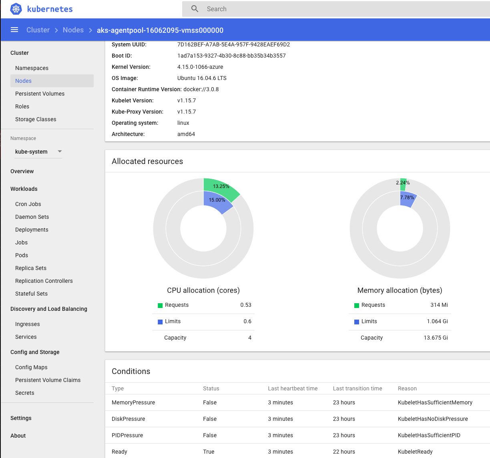
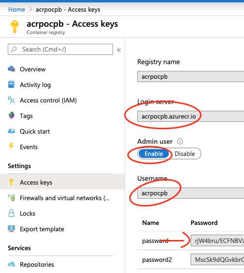
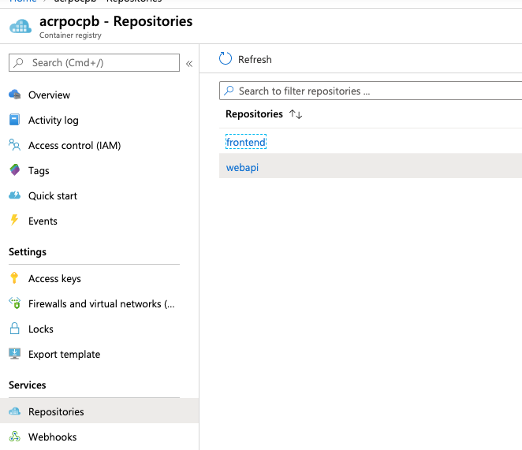
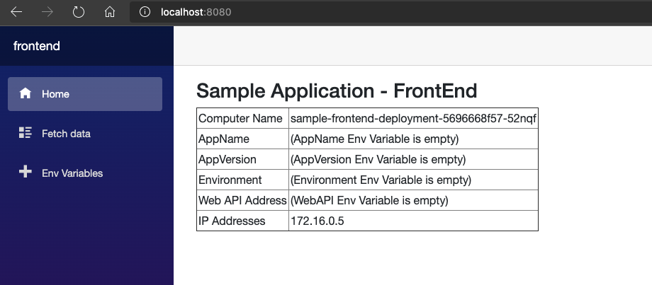
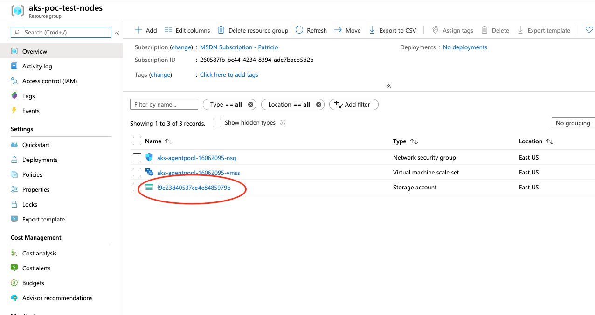
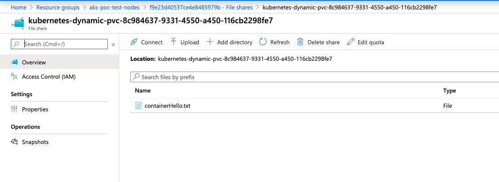

# AKS PoC - Step 2


  - AAD Integration - Setting  RBAC roles with AAD (k8 roles binding with aad groups)
  - Dashboard Overview		
  - Integrating ACR with AKS
  - Sample App
    - Deploying images stored in azure container registry
  - Persistent Storage (from Step 1)
  


## AAD Integration

### Creation of AAD Application

Follow the steps described [here](https://docs.microsoft.com/en-us/azure/aks/azure-ad-integration), until "Deploy the AKS cluster"

### ARM Template changes

To deploy an Azure AD integrated cluster, is needed to redeploy the current cluster. 
To have this in place, we created a copy of the aks-cluster file. In this case will be called [aks-cluster-step2.json](deploy/armtemplates/aks-cluster-step2.json)

Here are the changes to the template:


### Parameters

Added 4 parameters

````json
        "AAD_ClientAppID":{
            "type":"securestring",
            "metadata": {
                "description": "The Application ID for the Client App Service Principal"
            }
        },
        "AAD_ServerAppID":{
            "type":"securestring",
            "metadata": {
                "description": "The Application ID for the Server App Service Principal"
            }
        },
        "AAD_TenantID":{
            "type":"securestring",
            "metadata": {
                "description": "The Azure AD Tenant where the cluster will reside"
            }
        },
        "AAD_ServerAppSecret":{
            "type":"securestring",
            "metadata": {
                "description": "The Service Principal Secret for the Client App Service Principal"
            }
        }
````

Added an aadProfile to the template
````json
        "aadProfile": {
            "clientAppID": "[parameters('AAD_ClientAppID')]",
            "serverAppID": "[parameters('AAD_ServerAppID')]",
            "tenantID": "[parameters('AAD_TenantID')]",
            "serverAppSecret": "[parameters('AAD_ServerAppSecret')]"
        },
````

After this change, the newly created cluster will have integration with Azure AD.


### How to connect to the cluster

Once is created you will be able to list the cluster

````bash
az login
az aks list -o table
````

You should see an output as here

````bash
Name      Location    ResourceGroup     KubernetesVersion    ProvisioningState    Fqdn
--------  ----------  ----------------  -------------------  -------------------  --------------------------------------
akspocpb  eastus      aks-poc-test      1.15.7               Succeeded            akspocpb-f479139e.hcp.eastus.azmk8s.io
````
To install kubectl cli
````bash
az aks install-cli
````
After that, you can get credentials, to be used by kubectl
````bash
az aks get-credentials -n clustername -g groupname --admin
````

After that, you will be able to connect to your cluster and get the information as shown here:
````bash
kubectl get nodes

NAME                                STATUS   ROLES   AGE   VERSION
aks-agentpool-27322822-vmss000000   Ready    agent   23m   v1.15.7
akswpool000000                      Ready    agent   15m   v1.15.7
````

In case you want to provide access to particular AAD groups for read-only, others as admin, you can follow [this](https://docs.microsoft.com/en-us/azure/aks/azure-ad-rbac) guideline. Basically, you can bind a role (or clusterRole) to a user/group in Azure AD.
Here is one example of this definition:
````yaml
apiVersion: rbac.authorization.k8s.io/v1
kind: ClusterRoleBinding
metadata:
  name: local-cluster-admins
roleRef:
  apiGroup: rbac.authorization.k8s.io
  kind: ClusterRole
  name: cluster-admin
subjects:
- apiGroup: rbac.authorization.k8s.io
  kind: Group
  name: 6c2bc492-2d42-48b7-b5a1-da26830aa534
---
apiVersion: rbac.authorization.k8s.io/v1
kind: ClusterRoleBinding
metadata:
  name: local-cluster-readers
roleRef:
  apiGroup: rbac.authorization.k8s.io
  kind: ClusterRole
  name: view
subjects:
- apiGroup: rbac.authorization.k8s.io
  kind: Group
  name: d7b2ac3e-1679-4b4c-a7d4-c94a1c447c66
````

> These group IDs are related to the PoC environment and should be updated by the ones in your environment
> In addition, other Roles or ClusterRoles can be created with more granular configuration. Reference [here](https://kubernetes.io/docs/reference/access-authn-authz/rbac/)


Once you do this, your access will depend on the account you used for login. Here is an example using a readonly account:
````bash
az aks get-credentials -g resourcegroupname -n clustername
kubectl get pod
To sign in, use a web browser to open the page https://microsoft.com/devicelogin and enter the code FLEBCQRGS to authenticate.
````
Once I open a browser and log with one user that is part of the cluster readers group, here are the results:
````bash
kubectl apply -f rbac-aad-user.yaml

Error from server (Forbidden): error when retrieving current configuration of:
Resource: "rbac.authorization.k8s.io/v1, Resource=clusterrolebindings", GroupVersionKind: "rbac.authorization.k8s.io/v1, Kind=ClusterRoleBinding"
Name: "local-cluster-admins", Namespace: ""
Object: &{map["apiVersion":"rbac.authorization.k8s.io/v1" "kind":"ClusterRoleBinding" "metadata":map["annotations":map["kubectl.kubernetes.io/last-applied-configuration":""] "name":"local-cluster-admins"] "roleRef":map["apiGroup":"rbac.authorization.k8s.io" "kind":"ClusterRole" "name":"cluster-admin"] "subjects":[map["apiGroup":"rbac.authorization.k8s.io" "kind":"Group" "name":"6c2bc492-2d42-48b7-b5a1-da26830aa534"]]]}
from server for: "rbac-aad-user.yaml": clusterrolebindings.rbac.authorization.k8s.io "local-cluster-admins" is forbidden: User "patricio@pbelardo.onmicrosoft.com" cannot get resource "clusterrolebindings" in API group "rbac.authorization.k8s.io" at the cluster scope
````

## Dashboard Overview

To open the kubernetes dashboard, we should execute the following command:

````bash
az aks browse -n clustername -g resourcegroupname

The behavior of this command has been altered by the following extension: aks-preview
Merged "akspocpb" as current context in /var/folders/l9/sl910_6912q34fzdwdh1s9640000gn/T/tmpanj7n2_4
To sign in, use a web browser to open the page https://microsoft.com/devicelogin and enter the code F7Y7F7SPZ to authenticate.
Proxy running on http://127.0.0.1:8001/
Press CTRL+C to close the tunnel...
````

>Since we enabled RBAC, the system:serviceaccount:kube-system:kubernetes-dashboard should have permissions to view clusterRole or cluster-admin, depending the level of permissions we want to provide.

[Here](config/rbac-common/rbac-dashboard-user.yaml) is one example:
````yaml
apiVersion: rbac.authorization.k8s.io/v1
kind: ClusterRoleBinding
metadata:
  name: dashboard-cluster-admin
roleRef:
  apiGroup: rbac.authorization.k8s.io
  kind: ClusterRole
  name: cluster-admin
subjects:
- apiGroup: rbac.authorization.k8s.io
  kind: User
  name: system:serviceaccount:kube-system:kubernetes-dashboard
````

Once we define the permissions, we can see the dashboard as expected:



## Integrating ACR with AKS

For the creation of an ACR, we can execute:
````bash
az acr create -n containerRegistryName -g containerRegistryResourceGroup --sku basic
````
We can also create a template like in [this](https://raw.githubusercontent.com/Azure/azure-quickstart-templates/master/101-container-registry/azuredeploy.json) example

To integrate ACR with AKS, you can do a simple attach like explained [here](https://docs.microsoft.com/en-us/azure/aks/cluster-container-registry-integration#configure-acr-integration-for-existing-aks-clusters)

````bash
az aks update -n myAKSCluster -g myResourceGroup --attach-acr <acrName>
````

## Sample App

For this PoC, we created 2 applications:
- [frontend](sample-app/frontend)
- [webapi](sample-app/webapi)

The frontend app will communicate to the webapi. Frontend App will get information from environment variables to know where to look at the webapi, and also will get more contextual information, just to help us during our tests.
The environment variables the frontend will look at are:
- AppName
- AppVersion
- Environment
- WebAPI
- APPINSIGHTS_INSTRUMENTATIONKEY

### Build images

To build these applications in docker, you can execute

````bash
cd frontend
docker build -t frontend .
cd ..
cd webapi
docker build -t webapi .
cd ..

````

#### Publish images

To publish these images to the ACR already created, you can

````bash
docker tag webapi:latest acrpocpb.azurecr.io/webapi:latest
docker tag frontend:latest acrpocpb.azurecr.io/frontend:latest

docker push youracrname.azurecr.io/webapi:latest
docker push youracrname.azurecr.io/frontend:latest
````

> Before you can push the image, you should be logged to the registry. This is done by docker login, using the information of your ACR


After this action, you should see the images in your ACR repositories


Just in case you want to import the app into your ACR directly, and since is published in a public repository, you can run the following command:

````bash
az acr import  -n <myContainerRegistry> --source docker.io/patobelardo/frontend:latest --image frontend:latest
az acr import  -n <myContainerRegistry> --source docker.io/patobelardo/webapi:latest --image webapi:latest
````

## Deploying images stored in azure container registry

With the images already located at the attached ACR repositories, you can proceed deploying the application.

Here is one definition of a deployment (complete example [here](sample-app/app-deploy.yaml)):

````yaml
apiVersion: apps/v1
kind: Deployment
metadata:
  name: sample-frontend-deployment
  labels:
    app: sample-frontend-deployment
spec:
  replicas: 2
  selector:
    matchLabels:
      app: sample-frontend
  template:
    metadata:
      labels:
        app: sample-frontend
    spec:
      containers:
      - name: frontend
        image: acrpocpb.azurecr.io/frontend:latest
        ports:
        - containerPort: 80
````

After the deployment, you should see a svc and 2 pods at least
````bash
kubectl get po,svc

NAME                                              READY   STATUS    RESTARTS   AGE
pod/sample-frontend-deployment-5696668f57-2627g   1/1     Running   0          5m15s
pod/sample-frontend-deployment-5696668f57-52nqf   1/1     Running   0          5m15s

NAME                      TYPE        CLUSTER-IP      EXTERNAL-IP   PORT(S)   AGE
service/kubernetes        ClusterIP   10.112.28.97    <none>        443/TCP   24h
service/sample-frontend   ClusterIP   10.112.28.107   <none>        80/TCP    3m34s
````

To verify the frontend is working, you can do a [port-forward](https://kubernetes.io/docs/tasks/access-application-cluster/port-forward-access-application-cluster/)

````bash
kubectl port-forward service/sample-frontend 8080:80
````

After that, you should access to the frontend



## Persistent Storage

Reference: [Persistent Storage - AKS](https://docs.microsoft.com/en-us/azure/aks/azure-disks-dynamic-pv)

For this PoC we are using dynamic persistent volumes using Azure [Files](https://docs.microsoft.com/en-us/azure/aks/azure-files-dynamic-pv)

Following the same steps specified at the document, we create a [pvc.yaml](config/pvc.yaml) file with the required definitions.

You can verify the creation with

````yaml
kubectl get pvc

NAME        STATUS   VOLUME                                     CAPACITY   ACCESS MODES   STORAGECLASS   AGE
azurefile   Bound    pvc-8c984637-9331-4550-a450-116cb2298fe7   5Gi        RWX            azurefile      34s
````

Now, to use this volume, we can modify the deployment definition, adding this

```yaml
    volumeMounts:
    - mountPath: "/mnt/azure"
      name: volume
  volumes:
    - name: volume
      persistentVolumeClaim:
        claimName: azurefile
````

The resultant yaml should be like this
````yaml
apiVersion: apps/v1
kind: Deployment
metadata:
  name: sample-frontend-deployment
  labels:
    app: sample-frontend
spec:
  replicas: 2
  selector:
    matchLabels:
      app: sample-frontend
  template:
    metadata:
      labels:
        app: sample-frontend
    spec:
      containers:
      - name: frontend
        image: acrpocpb.azurecr.io/frontend:latest
        env:
        - name: WebAPI
          value: http://sample-webapi
        ports:
        - containerPort: 80
        volumeMounts:
        - mountPath: "/mnt/azure"
          name: volume
      volumes:
        - name: volume
          persistentVolumeClaim:
            claimName: azurefile       
````

Now, if we enter to a pod, we should see a folder called /mnt/azure, that is a reference to an Azure Files resource.

````bash
kubectl get pod

NAME                                         READY   STATUS    RESTARTS   AGE
sample-frontend-deployment-58cd7c4d8-j9pdc   1/1     Running   0          46s
sample-frontend-deployment-58cd7c4d8-tgszl   1/1     Running   0          50s
sample-webapi-deployment-7fbc4f8d79-6lptc    1/1     Running   0          9m32s
sample-webapi-deployment-7fbc4f8d79-djmcg    1/1     Running   0          9m32s

kubectl exec -ti sample-frontend-deployment-58cd7c4d8-j9pdc bash

root@sample-frontend-deployment-58cd7c4d8-j9pdc:/app# cd /mnt/azure
root@sample-frontend-deployment-58cd7c4d8-j9pdc:/mnt/azure# ls
root@sample-frontend-deployment-58cd7c4d8-j9pdc:/mnt/azure# echo "Hello from the container" > containerHello.txt
root@sample-frontend-deployment-58cd7c4d8-j9pdc:/mnt/azure# exit
exit

kubectl exec -ti sample-frontend-deployment-58cd7c4d8-tgszl bash
root@sample-frontend-deployment-58cd7c4d8-tgszl:/app# ls /mnt/azure

containerHello.txt

exit

````

From the Azure resources, we can see this



In this new storage account, there is a new share, dinamically created, where we can see the file created from the container

