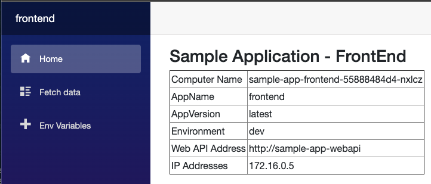
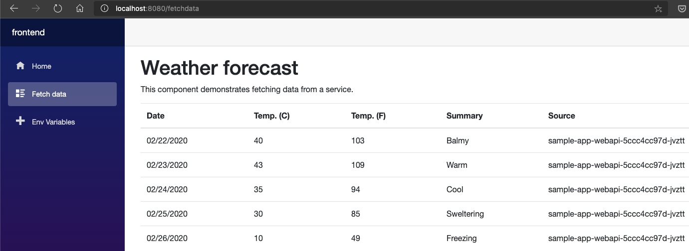
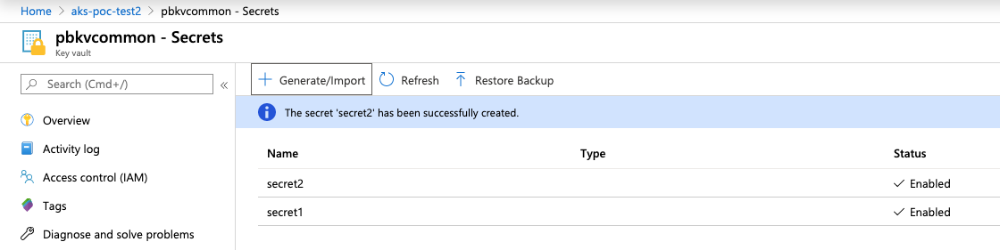
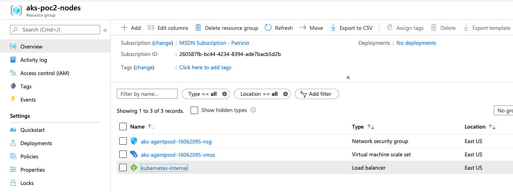
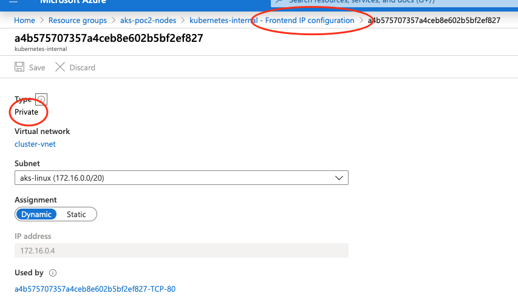

# AKS PoC - Step 3


 - Network Policies for namespaces
    - Restricting access between namespaces
 - Key Store
    - Using azure vault or hashicorp vault
 - Private IP Ingress/Egress endpoints for applications. 
 - Securing AKS management API’s to datacenter IP’s 
    - Whitelisting 


## Network Policies

### Restricting access between namespaces

There are several recipes online. One good source of them is located [here](https://github.com/ahmetb/kubernetes-network-policy-recipes)

For this particular example, we took [this](https://github.com/ahmetb/kubernetes-network-policy-recipes/blob/master/04-deny-traffic-from-other-namespaces.md) recipe, which will allow traffic only from the current namespace but no between namespaces


### Setup

To test this policy, we will use a [helm chart](sample-app-helm/) that deploys the same sample application we had previously, including the namespace as parameter, so we can deploy it to different namespaces.

After install [helm](https://helm.sh/docs/intro/install/), we need to setup tiller, who will be the agent that runs and controls the helm charts.

> Since we are using RBAC, we need to setup a service account as we did [here](config/rbac-tiller.yaml)
````bash

helm init --service-account tiller

$HELM_HOME has been configured at /Users/pbelardo/.helm.

Tiller (the Helm server-side component) has been installed into your Kubernetes Cluster.

Please note: by default, Tiller is deployed with an insecure 'allow unauthenticated users' policy.
To prevent this, run `helm init` with the --tiller-tls-verify flag.
For more information on securing your installation see: https://docs.helm.sh/using_helm/#securing-your-helm-installation
Happy Helming!


kubectl get pod --all-namespaces


NAMESPACE     NAME                                    READY   STATUS    RESTARTS   AGE
[filtered view]
kube-system   tiller-deploy-565f8f87bf-6rkdh          0/1     Running   0          11s
[filtered view]
````

Once you have tiller running, you should install the application in 2 namespaces. In this case, we created dev and test

````bash
kubectl create namespace dev
kubectl create namespace test


helm install sample-app-helm -n sample-app-dev --set namespace=dev
helm install sample-app-helm -n sample-app-test --set namespace=test

````

After the execution, we should see this information:

````bash
kubectl get svc,pod --namespace dev

NAME                          TYPE        CLUSTER-IP      EXTERNAL-IP   PORT(S)   AGE
service/sample-app-frontend   ClusterIP   10.112.28.100   <none>        80/TCP    108s
service/sample-app-webapi     ClusterIP   10.112.28.108   <none>        80/TCP    108s

NAME                                       READY   STATUS    RESTARTS   AGE
pod/sample-app-frontend-55888484d4-hq6rt   1/1     Running   0          108s
pod/sample-app-frontend-55888484d4-rzqkb   1/1     Running   0          108s
pod/sample-app-webapi-5ccc4cc97d-tc762     1/1     Running   0          108s
pod/sample-app-webapi-5ccc4cc97d-xszfq     1/1     Running   0          108s

kubectl get svc,pod --namespace test

NAME                          TYPE        CLUSTER-IP      EXTERNAL-IP   PORT(S)   AGE
service/sample-app-frontend   ClusterIP   10.112.28.121   <none>        80/TCP    37s
service/sample-app-webapi     ClusterIP   10.112.28.102   <none>        80/TCP    37s

NAME                                       READY   STATUS    RESTARTS   AGE
pod/sample-app-frontend-5fd7769d45-bb2rm   1/1     Running   0          37s
pod/sample-app-frontend-5fd7769d45-zhjqn   1/1     Running   0          37s
pod/sample-app-webapi-8498658dfc-cfc2d     1/1     Running   0          37s
pod/sample-app-webapi-8498658dfc-hd64b     1/1     Running   0          37s

````

> To see one frontend from your local computer, you can proceed with kubectl port-forward service/sample-app-frontend 8080:80 -n namespace


As you can see, after this implementation, if we enter to one specific frontend container/pod, we can ping to the webapi using dns names

````bash
[from dev]

kubectl exec -ti sample-app-frontend-55888484d4-5bsgq bash

root@sample-app-frontend-55888484d4-5bsgq:/app# curl  http://sample-app-webapi/Weatherforecast
[{"date":"2020-02-22T14:23:54.0641392+00:00","temperatureC":43,"temperatureF":109,"summary":"Warm","computerName":"sample-app-webapi-5ccc4cc97d-jvztt"},{"date":"2020-02-23T14:23:54.0641483+00:00","temperatureC":16,"temperatureF":60,"summary":"Hot","computerName":"sample-app-webapi-5ccc4cc97d-jvztt"},{"date":"2020-02-24T14:23:54.0641494+00:00","temperatureC":13,"temperatureF":55,"summary":"Freezing","computerName":"sample-app-webapi-5ccc4cc97d-jvztt"},{"date":"2020-02-25T14:23:54.0641502+00:00","temperatureC":33,"temperatureF":91,"summary":"Mild","computerName":"sample-app-webapi-5ccc4cc97d-jvztt"},{"date":"2020-02-26T14:23:54.0641511+00:00","temperatureC":23,"temperatureF":73,"summary":"Chilly","computerName":"sample-app-webapi-5ccc4cc97d-jvztt"}]


root@sample-app-frontend-55888484d4-5bsgq:/app# curl  http://sample-app-webapi.test.svc.cluster.local/Weatherforecast
[{"date":"2020-02-22T14:31:04.9451321+00:00","temperatureC":26,"temperatureF":78,"summary":"Mild","computerName":"sample-app-webapi-8498658dfc-vx27z"},{"date":"2020-02-23T14:31:04.9451424+00:00","temperatureC":-12,"temperatureF":11,"summary":"Hot","computerName":"sample-app-webapi-8498658dfc-vx27z"},{"date":"2020-02-24T14:31:04.9451439+00:00","temperatureC":42,"temperatureF":107,"summary":"Warm","computerName":"sample-app-webapi-8498658dfc-vx27z"},{"date":"2020-02-25T14:31:04.9451452+00:00","temperatureC":51,"temperatureF":123,"summary":"Balmy","computerName":"sample-app-webapi-8498658dfc-vx27z"},{"date":"2020-02-26T14:31:04.9451464+00:00","temperatureC":-18,"temperatureF":0,"summary":"Scorching","computerName":"sample-app-webapi-8498658dfc-vx27z"}]

````
> As you can see, from the frontend at dev namespace, we can contact the webapi at the test namespace http://<service name>.<namespace name>.svc.cluster.local

### Install the network policy

We used the [](config/network-policies/deny-from-others-dev-test.yaml) file
````bash
kubectl apply -f deny-from-others-dev-test.yaml
````

After that, if we test the communication for the same namespace, everything works as expected (kubectl port-forward service/sample-app-frontend 8080:80)



When we try to access to other namespaces, we should receive an error:

````bash
root@sample-app-frontend-55888484d4-jw8ln:/app# curl http://sample-app-webapi/weatherforecast

[{"date":"2020-02-22T16:36:17.1417663+00:00","temperatureC":46,"temperatureF":114,"summary":"Balmy","computerName":"sample-app-webapi-5ccc4cc97d-k7qk5"},{"date":"2020-02-23T16:36:17.1418168+00:00","temperatureC":32,"temperatureF":89,"summary":"Warm","computerName":"sample-app-webapi-5ccc4cc97d-k7qk5"},{"date":"2020-02-24T16:36:17.1418215+00:00","temperatureC":-6,"temperatureF":22,"summary":"Freezing","computerName":"sample-app-webapi-5ccc4cc97d-k7qk5"},{"date":"2020-02-25T16:36:17.141823+00:00","temperatureC":-16,"temperatureF":4,"summary":"Balmy","computerName":"sample-app-webapi-5ccc4cc97d-k7qk5"},{"date":"2020-02-26T16:36:17.1418245+00:00","temperatureC":-10,"temperatureF":15,"summary":"Cool","computerName":"sample-app-webapi-5ccc4cc97d-k7qk5"}]

root@sample-app-frontend-55888484d4-jw8ln:/app# curl http://sample-app-webapi.test.svc.cluster.local/weatherforecast
curl: (7) Failed to connect to sample-app-webapi.test.svc.cluster.local port 80: Connection timed out

root@sample-app-frontend-55888484d4-jw8ln:/app#
````

Just to double check, if we delete these policies, we are able to do cross-communication between namespaces again

````bash
pbelardo@Patricios-Mini files % k delete -f config/network-policies/deny-from-others-dev-test.yaml
networkpolicy.networking.k8s.io "deny-from-other-namespaces" deleted
networkpolicy.networking.k8s.io "deny-from-other-namespaces" deleted
pbelardo@Patricios-Mini files % k exec -ti sample-app-frontend-55888484d4-jw8ln bash

root@sample-app-frontend-55888484d4-jw8ln:/app# curl http://sample-app-webapi.test.svc.cluster.local/Weatherforecast

[{"date":"2020-02-22T16:40:14.41754+00:00","temperatureC":32,"temperatureF":89,"summary":"Bracing","computerName":"sample-app-webapi-8498658dfc-v6t7j"},{"date":"2020-02-23T16:40:14.4175468+00:00","temperatureC":-3,"temperatureF":27,"summary":"Sweltering","computerName":"sample-app-webapi-8498658dfc-v6t7j"},{"date":"2020-02-24T16:40:14.4175577+00:00","temperatureC":24,"temperatureF":75,"summary":"Scorching","computerName":"sample-app-webapi-8498658dfc-v6t7j"},{"date":"2020-02-25T16:40:14.417559+00:00","temperatureC":48,"temperatureF":118,"summary":"Chilly","computerName":"sample-app-webapi-8498658dfc-v6t7j"},{"date":"2020-02-26T16:40:14.4175601+00:00","temperatureC":42,"temperatureF":107,"summary":"Mild","computerName":"sample-app-webapi-8498658dfc-v6t7j"}]````


## Key Store - Using Azure Key Vault

To implement the flexvolume feature, that integrates Azure Key Vault with Kubernetes, you should follow this [guide](https://github.com/Azure/kubernetes-keyvault-flexvol#option-2-existing-aks-cluster)


Now, one of the ways Key Vault integration is working is using a service principal. For this PoC this is the [approach](https://github.com/Azure/kubernetes-keyvault-flexvol#option-1-service-principal) we will follow.

FOr that purpose, we need to assign permissions to the service principal to access Key Vault

````bash
kubectl create secret generic kvcreds --from-literal clientid=<appid> --from-literal clientsecret=<secret> --type=azure/kv

# [Required for version < v0.0.13] Assign Reader Role to the service principal for your keyvault
az role assignment create --role Reader --assignee <appid> --scope /subscriptions/<subscriptionid>/resourcegroups/aks-poc-test2/providers/Microsoft.KeyVault/vaults/<keyvaultname>

KV_NAME=pbkvcommon
# Assign key vault permissions to your service principal
az keyvault set-policy -n $KV_NAME --key-permissions get --spn <appid>
az keyvault set-policy -n $KV_NAME --secret-permissions get --spn <appid>
az keyvault set-policy -n $KV_NAME --certificate-permissions get --spn <appid>

For this PoC I created 2 secrets


````
After that, we can test an [example](config/keyvault-integration/sample-app-kv.yaml)
````bash
kubectl apply -f sample-app-kv.yaml
````

To validate the integration, you can verify at the kvmnt folder at one of the containers
````bash
pbelardo@Patricios-Mini files % k exec -ti sample-frontend-deployment-55b9b46fbc-r2x7j bash

root@sample-frontend-deployment-55b9b46fbc-r2x7j:/# ls
app  bin  boot	dev  etc  home	kvmnt  lib  lib64  media  mnt  opt  proc  root	run  sbin  srv	sys  tmp  usr  var

root@sample-frontend-deployment-55b9b46fbc-r2x7j:/# cd kvmnt/
root@sample-frontend-deployment-55b9b46fbc-r2x7j:/kvmnt# ls
secret1  secret2

root@sample-frontend-deployment-55b9b46fbc-r2x7j:/kvmnt# cat secret1
value1

root@sample-frontend-deployment-55b9b46fbc-r2x7j:/kvmnt#
````

## Private IP Ingress/Egress endpoints for applications. 

For private IP ingress to the cluster, we can create services using Internal Load Balancers, instead of the External ones, so the ingress will be accept only internal traffic.
We can, in addition, create ingress controllers to have a L7 layer that will redirect the traffic to the corresponding service, depending some predefined condition (hostname, url, etc)

We created a sample app template [here](config/internal-lb/sample-app-ilb.yaml)

In this example we will have a frontend and a service of type Load Balancer who will use an internal load balancer IP. To deploy, you can run
````bash
kubectl apply sample-app-ilb.yaml

kubectl get svc

NAME                  TYPE           CLUSTER-IP      EXTERNAL-IP   PORT(S)        AGE
sample-frontend       LoadBalancer   10.112.28.124   <pending>     80:31595/TCP   5s
````
Once the ILB is provisioned in Azure, you should see something like this
````bash
kubectl get svc
NAME                  TYPE           CLUSTER-IP      EXTERNAL-IP   PORT(S)        AGE
sample-frontend       LoadBalancer   10.112.28.124   172.16.0.4    80:31595/TCP   118s
````

As you can see here, the "External-IP" is one IP located at the subnet, in the same address space as the Pods are

````bash
kubectl get pod -o wide

NAME                                          READY   STATUS    RESTARTS   AGE     IP            NODE                                NOMINATED NODE   READINESS GATES
sample-app-frontend-55888484d4-jw8ln          1/1     Running   0          3h1m    172.16.0.53   aks-agentpool-16062095-vmss000000   <none>           <none>
sample-app-frontend-55888484d4-npczd          1/1     Running   0          3h1m    172.16.0.68   aks-agentpool-16062095-vmss000000   <none>           <none>
````
From the Portal, you should see this



Now the service can be accesed by private traffic (from one container or VM in the subnet), usign the IP 172.16.0.4, as we can see here:
````bash
 /app# curl http://172.16.0.4

<!DOCTYPE html>
<html lang="en">
<head>
    <meta charset="utf-8" />
    <meta name="viewport" content="width=device-width, initial-scale=1.0" />
    <title>frontend</title>
    <base href="/" />
    <link rel="stylesheet" href="css/bootstrap/bootstrap.min.css" />
    <link href="css/site.css" rel="stylesheet" />
</head>
<body>
    <app>
    ...
    ...
````

##  Securing AKS management API’s to datacenter IP’s (Whitelisting )

All the information related to this feature is located [here](https://docs.microsoft.com/en-us/azure/aks/api-server-authorized-ip-ranges)

To allow specific rangas, we can do it from the armtemplate, adding the apiServerAuthorizedIPRanges configuration AND an standard load balancer configuration.

> This setting will create an external load balancer

This information was added to the template [aks-cluster-step2.json](deploy/armtemplates/aks-cluster-step2.json)

Once we defined the IP range, it will be the only cidr that can have access to the Kubernetes API for this particular cluster. 